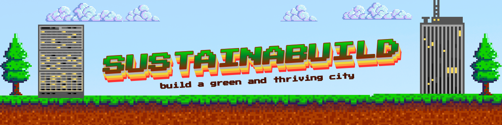

README.md Contents


# 🌱 SustainaBuild — Sustainable City Console Simulator

---

## **Project Title**
**SustainaBuild — Sustainable City Console Simulator**

---

## **Description / Overview**
**SustainaBuild** is a Java console-based city simulation game where you play as a _sustainable urban planner_.

Your goal: grow a thriving city while balancing:

- 👥 **Population**
- 😊 **Happiness**
- 🌫️ **Pollution**
- 🏙️ **Available Space**

Each building affects the city differently. For example:

- 🏭 **Factory** → +Population, +Pollution  
- 🏠 **House** → +Population, small space cost
- 🌳 **Tree** → +Happiness, –Pollution  
- 🏥 **Hospital** → +Happiness, +Pollution
- 🎢 **ThemePark** → +Happiness, high space cost 
- 🏢 **Market** → +Population, moderate pollution

The game ends if the city **runs out of space** or **Eco Score hits less than 25**.

---

## **OOP Concepts Applied**

### 🔹 **Abstraction**
`Building` is an abstract class defining shared attributes (name, pollutionImpact, etc.) and the abstract method `build()`.

### 🔹 **Encapsulation**
All fields in `Building` and `CityManager` are `private`.  
Only getters/setters expose data safely.

### 🔹 **Inheritance**
Concrete buildings such as `Factory`, `House`, `Park`, `Tree`, `Hospital`, and `Market` all extend `Building`.

### 🔹 **Polymorphism**
Each building overrides `build()`, and at runtime the correct implementation executes depending on the building type.

---

## **Program Structure**

### 📁 **Folder Layout**
```text
📁 src/
├── ☕ Main.java
├── ☕ CityManager.java
└── 📁 buildings/
        ├── ☕ Building.java
        ├── ☕ Factory.java
        ├── ☕ Hospital.java
        ├── ☕ House.java
        ├── ☕ InvalidConstructionException.java
        ├── ☕ Market.java
        ├── ☕ ThemePark.java
        └── ☕ Tree.java
```
## **How to Run the Program**
1. **Clone the repository:**
     ```bash
     git clone https://github.com/heyjhude-0/SustainaBuild.git
     ```
2. **Open your terminal in src/ folder**
3. **Run the program using:**
     ```bash
     java Main.java
     ```


## **Sample Output**
```text
╔----------------------------------------------------------------------------------╗
|                        WELCOME TO SUSTAINABUILD!👋                               |
|----------------------------------------------------------------------------------|
|           🏦  Choose, and construct buildings and take up available space.       |
|                   🌲  Balance progress and sustainability.                       |
|   🧠  Strategic thinking becomes essential to maintain a green and thriving city.|
╚----------------------------------------------------------------------------------╝

        1. 🕹  Start Game
        2. ❓  How to Play
        3. 📃  Credits
        4. ❌  Exit

        Choose an option: 1


🎮   GAME START

🏦🏦  Choose building to create: 🏦🏦

1. 🏭  Factory          2. 🏠  House
3. 🌳  Tree             4. 🏥  Hospital
5. 🎢  Theme Park       6. 🏢  Market
7. ❌   Exit
Your choice: 3

🌳    You planted Trees! The city air feels cleaner and fresher.
📊    +0 Population | +3 Happiness | -5 Pollution | -3 Space


📊  YOUR CITY STATUS:
        🏢  Current buildings: 🌳  Tree,
        👨  Current Population: 0
        😄  Current Happiness: 53
        🌫  Current Pollution: 0
        🕳  Remaining Space: 97
        ☘  Eco Score: 42
🎮  Press...
[C] to continue building.
[ ] any button to Exit and show your current score.
```


## **Author and Acknowledgement**


### **Authors**
| Name | GitHub |
|------|--------|
| Dagle, Jhude Dominic |[heyjhude-0](https://github.com/heyjhude-0)|
| Gonzales, Faith |[fayeths](https://github.com/fayeths)|
| Hernandez, Nhealeen Fae D. |[nhea2004](https://github.com/nhea2004)|

### **Acknowledgement**
We would like to sincerely express our gratitude to our *Instructor in Object-Oriented Programming*, **Ms. Fatima Marie Agdon**, for her guidance and for sharing her knowledge of **Object-Oriented Programming** (OOP) concepts and best practices. We also extend our appreciation to our team members for their cooperation, dedication and effort to complete this activity. 


